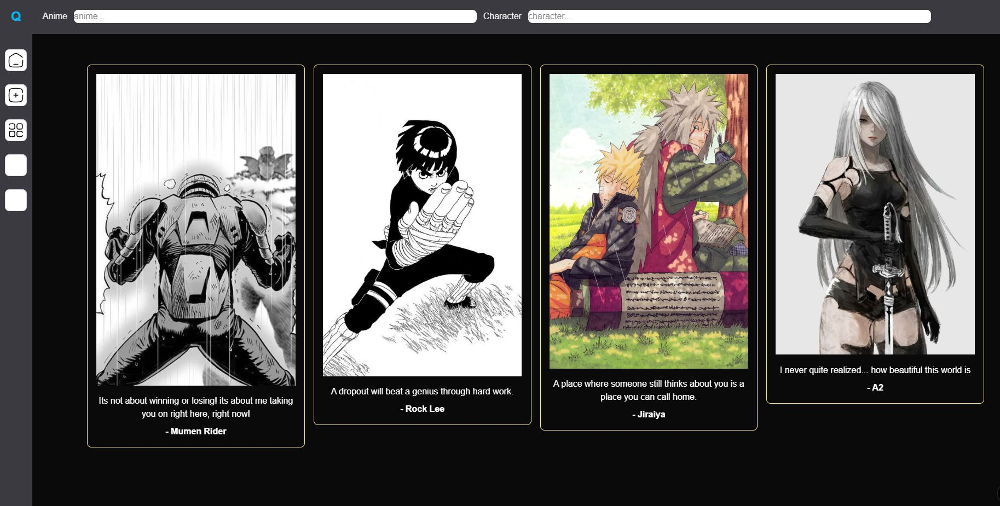

## 📝 Project Overview: Weeb Words

Weeb Words is a sleek and minimalist anime quote web app where users can view, filter, and submit inspirational, emotional, or funny quotes from popular anime characters. Designed with a focus on simplicity and speed, it connects to a REST API and offers a dynamic UI built using Next.js and TailwindCSS.

🚀 Features

🎴 Random Anime Quote Generator

🔍 Filter by Anime Title

🖼️ Quote Gallery with Image Support

📝 Submit Your Own Quotes

⚡ Fast & Responsive UI (TailwindCSS)

🔌 Connected to a RESTful API (ASP.NET backend)

## Screenshots

## 🛠 Tech Stack

Frontend:
Next.js (App Router), React, TypeScript

Styling:
TailwindCSS, Responsive Design

State Magement:
React Hooks

Backend API:
ASP.NET Core (REST), Entity Framework Core

